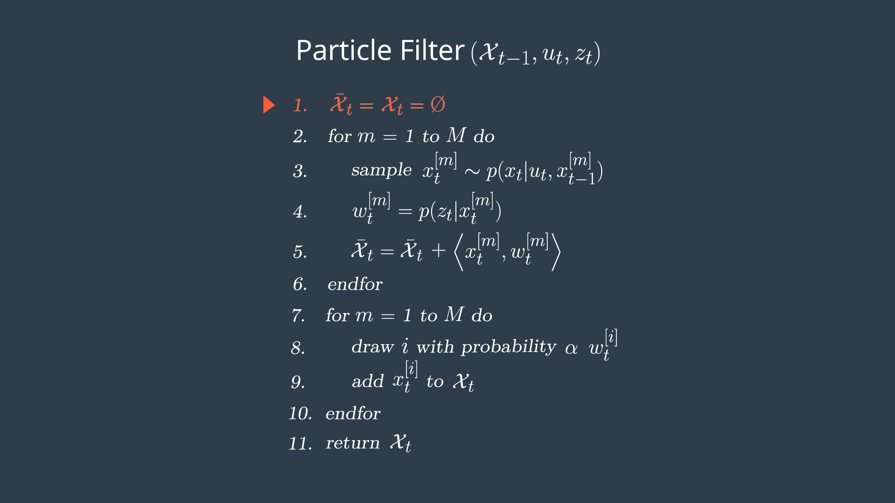

Project: Kidnapped Vehicle([`Particle Filter`](https://en.wikipedia.org/wiki/Particle_filter))
---

[](http://www.udacity.com/drive)

### Introduction

*The robot has been kidnapped and transported to a new location! Luckily it has a map of this location, a (noisy) GPS estimate of its initial location, and lots of (noisy) sensor and control data.*

*In this project we will implement a 2 dimensional particle filter in C++. The particle filter will be given a map and some initial localization information (analogous to what a GPS would provide). At each time step particle filter will also get observation and control data.*

---
||
|----------------------------------|
|[Running instructions](https://www.youtube.com/watch?v=neGq381AG64) |

### Particle Filter Implemetation
Following are the steps for a particle filter implentation.

**Note: These steps were taken from [Udacity Self Driving Car Engineer Nano Degree Programe](https://www.udacity.com/course/self-driving-car-engineer-nanodegree--nd013).**

##### Particle Filter Algorithm Steps and Inputs
*The flowchart below represents the steps of the particle filter algorithm as well as its inputs.*

||
|----------------------------------|
|Source: [Udacity Self Driving Car Engineer](https://www.udacity.com/course/self-driving-car-engineer-nanodegree--nd013) |

##### Psuedo Code

*This is an outline of steps you will need to take with your code in order to implement a particle filter for localizing an autonomous vehicle. The pseudo code steps correspond to the steps in the algorithm flow chart, initialization, prediction, particle weight updates, and resampling([Full C++ implementation](src/particle_filter.cpp)).* 

##### Initialization

*At the initialization step we estimate our position from GPS input. The subsequent steps in the process will refine this estimate to localize our vehicle.*


||
|----------------------------------|
|Source: [Udacity Self Driving Car Engineer](https://www.udacity.com/course/self-driving-car-engineer-nanodegree--nd013) |

`C++ Imeplementation for this project.`

```cpp
void ParticleFilter::init(double x, double y, double theta, double std[])
{
    if (is_initialized)
        return;
    // create normal(Guassinan) distribution for x
    normal_distribution<double> dist_x(x, std[0]);
    // create normal(Guassinan) distribution for y
    normal_distribution<double> dist_y(y, std[1]);
    // create normal(Guassinan) distribution for theta
    normal_distribution<double> dist_theta(theta, std[2]);

    // set the number of particles
//    num_particles = 100;
    // create particles
    for (int i = 0; i < num_particles; ++i)
    {
        Particle particle;
        particle.id = i;
        particle.x = dist_x(gen);
        particle.y = dist_y(gen);
        particle.theta = dist_theta(gen);
        particle.weight = 1.0;
        particles.emplace_back(particle);
    }
    is_initialized = true;
}
```


###### Prediction

During the prediction step we add the control input (yaw rate & velocity) for all particles.

||
|----------------------------------|
|Source: [Udacity Self Driving Car Engineer](https://www.udacity.com/course/self-driving-car-engineer-nanodegree--nd013) |

`C++ Imeplementation for this project.`

```cpp
void ParticleFilter::prediction(double delta_t, double std_pos[], double velocity, double yaw_rate)
{
    // create normal(Guassinan) distribution for x
    normal_distribution<double> dist_x(0, std_pos[0]);
    // create normal(Guassinan) distribution for y
    normal_distribution<double> dist_y(0, std_pos[1]);
    // create normal(Guassinan) distribution for theta
    normal_distribution<double> dist_theta(0, std_pos[2]);

    for (auto &particle: particles)
    {
        double theta = particle.theta;
        if (fabs(yaw_rate) < 0.00001)
        {
            particle.x += velocity * delta_t * cos(theta);
            particle.y += velocity * delta_t * sin(theta);
        }
        else
        {
            particle.x += velocity / yaw_rate * (sin(theta + yaw_rate * delta_t) - sin(theta));
            particle.y += velocity / yaw_rate * (cos(theta) - cos(theta + yaw_rate * delta_t));
            particle.theta += yaw_rate * delta_t;
        }
        // Adding noises
        particle.x += dist_x(gen);
        particle.y += dist_y(gen);
        particle.theta += dist_theta(gen);
    }
}
```
