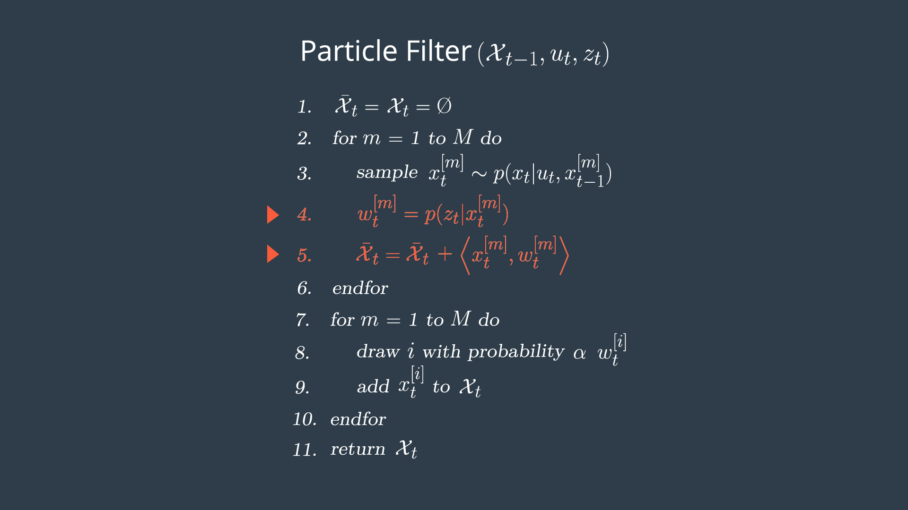

Project: Kidnapped Vehicle([`Particle Filter`](https://en.wikipedia.org/wiki/Particle_filter))
---

[](http://www.udacity.com/drive)

### Introduction

*The robot has been kidnapped and transported to a new location! Luckily it has a map of this location, a (noisy) GPS estimate of its initial location, and lots of (noisy) sensor and control data.*

*In this project we will implement a 2 dimensional particle filter in C++. The particle filter will be given a map and some initial localization information (analogous to what a GPS would provide). At each time step particle filter will also get observation and control data.*

---
||
|----------------------------------|
|[Running instructions](https://www.youtube.com/watch?v=neGq381AG64) |

### Particle Filter Implemetation
Following are the steps for a particle filter implentation.

**Note: These steps were taken from [Udacity Self Driving Car Engineer Nano Degree Programe](https://www.udacity.com/course/self-driving-car-engineer-nanodegree--nd013).**

##### Particle Filter Algorithm Steps and Inputs
*The flowchart below represents the steps of the particle filter algorithm as well as its inputs.*

||
|----------------------------------|
|Source: [Udacity Self Driving Car Engineer](https://www.udacity.com/course/self-driving-car-engineer-nanodegree--nd013) |

##### Psuedo Code

*This is an outline of steps you will need to take with your code in order to implement a particle filter for localizing an autonomous vehicle. The pseudo code steps correspond to the steps in the algorithm flow chart, initialization, prediction, particle weight updates, and resampling([Full C++ implementation](src/particle_filter.cpp)).* 

##### Initialization

*At the initialization step we estimate our position from GPS input. The subsequent steps in the process will refine this estimate to localize our vehicle.*


||
|----------------------------------|
|Source: [Udacity Self Driving Car Engineer](https://www.udacity.com/course/self-driving-car-engineer-nanodegree--nd013) |

`C++ Imeplementation for this project.`

```cpp
void ParticleFilter::init(double x, double y, double theta, double std[])
{
    if (is_initialized)
        return;
    // create normal(Guassinan) distribution for x
    normal_distribution<double> dist_x(x, std[0]);
    // create normal(Guassinan) distribution for y
    normal_distribution<double> dist_y(y, std[1]);
    // create normal(Guassinan) distribution for theta
    normal_distribution<double> dist_theta(theta, std[2]);

    // set the number of particles
//    num_particles = 100;
    // create particles
    for (int i = 0; i < num_particles; ++i)
    {
        Particle particle;
        particle.id = i;
        particle.x = dist_x(gen);
        particle.y = dist_y(gen);
        particle.theta = dist_theta(gen);
        particle.weight = 1.0;
        particles.emplace_back(particle);
    }
    is_initialized = true;
}
```


###### Prediction

*During the prediction step we add the control input (yaw rate & velocity) for all particles.*

||
|----------------------------------|
|Source: [Udacity Self Driving Car Engineer](https://www.udacity.com/course/self-driving-car-engineer-nanodegree--nd013) |

`C++ Imeplementation for this project.`

```cpp
void ParticleFilter::prediction(double delta_t, double std_pos[], double velocity, double yaw_rate)
{
    // create normal(Guassinan) distribution for x
    normal_distribution<double> dist_x(0, std_pos[0]);
    // create normal(Guassinan) distribution for y
    normal_distribution<double> dist_y(0, std_pos[1]);
    // create normal(Guassinan) distribution for theta
    normal_distribution<double> dist_theta(0, std_pos[2]);

    for (auto &particle: particles)
    {
        double theta = particle.theta;
        if (fabs(yaw_rate) < 0.00001)
        {
            particle.x += velocity * delta_t * cos(theta);
            particle.y += velocity * delta_t * sin(theta);
        }
        else
        {
            particle.x += velocity / yaw_rate * (sin(theta + yaw_rate * delta_t) - sin(theta));
            particle.y += velocity / yaw_rate * (cos(theta) - cos(theta + yaw_rate * delta_t));
            particle.theta += yaw_rate * delta_t;
        }
        // Adding noises
        particle.x += dist_x(gen);
        particle.y += dist_y(gen);
        particle.theta += dist_theta(gen);
    }
}
```

###### Update
*During the update step, we update our particle weights using map landmark positions and feature measurements.*

||
|----------------------------------|
|Source: [Udacity Self Driving Car Engineer](https://www.udacity.com/course/self-driving-car-engineer-nanodegree--nd013) |

`C++ Imeplementation for this project.`

```cpp
void ParticleFilter::updateWeights(double sensor_range, double std_landmark[], const vector<LandmarkObs> &observations,
                                   const Map &map_landmarks)
{
    double stdland_x = std_landmark[0];
    double stdland_y = std_landmark[1];

    for (auto &particle: particles)
    {
        double x, y, theta;
        x = particle.x;
        y = particle.y;
        theta = particle.theta;

        // find landmarks in the map that are in particle's sensor range.
        vector<LandmarkObs> inRangeLandmarks; // predictions
        for (const auto &landmark : map_landmarks.landmark_list)
        {
            float landmark_x = landmark.x_f;
            float landmark_y = landmark.y_f;
            int id = landmark.id_i;

            if (fabs(landmark_x - x) <= sensor_range && fabs(landmark_y - y) <= sensor_range)
            {
                inRangeLandmarks.emplace_back(LandmarkObs{id, landmark_x, landmark_y});
            }
        }

        // transform observation coodinates(measured in particle's coordinate system) to map  coodinates
        vector<LandmarkObs> mappedObservations;
        for (const auto &observation : observations)
        {
            double mapped_x = cos(theta) * observation.x - sin(theta) * observation.y + x;
            double mapped_y = sin(theta) * observation.x + cos(theta) * observation.y + y;
            mappedObservations.emplace_back(LandmarkObs{observation.id, mapped_x, mapped_y});
        }

        // update the nearest landmark for each observation
        dataAssociation(inRangeLandmarks, mappedObservations);

        // reseting the weight
        particle.weight = 1.0;

        // calculate  weights
        for (const auto &mappedObservation: mappedObservations)
        {
            int landmark_id = mappedObservation.id;
            double landmark_x, landmark_y;
            landmark_x = 0.0;
            landmark_y = 0.0;
            for (const auto &landmark : inRangeLandmarks)
            {
                if (landmark.id == landmark_id)
                {
                    landmark_x = landmark.x;
                    landmark_y = landmark.y;
                    break;
                }
            }
            // calculate weight
            double dx = mappedObservation.x - landmark_x;
            double dy = mappedObservation.y - landmark_y;
            // Multivariate Gaussian probabilty
            double gaussian_norm = (1.0 / 2 * M_PI * stdland_x * stdland_y);
            double exponent = pow(dx, 2) / (2 * pow(stdland_x, 2)) + pow(dy, 2) / (2 * pow(stdland_y, 2));
            double weight = gaussian_norm * exp(-exponent);
            if (weight == 0.0)
                particle.weight *= 0.00001;
            else
                particle.weight *= weight;
        }
    }
}
```

###### Resampling

*During resampling we will resample M times (M is range of 0 to length_of_particleArray) drawing a particle i (i is the particle index) proportional to its weight .*

||
|----------------------------------|
|Source: [Udacity Self Driving Car Engineer](https://www.udacity.com/course/self-driving-car-engineer-nanodegree--nd013) |

`C++ Imeplementation for this project.`

```cpp
void ParticleFilter::resample()
{
    // get weights and max weight
    vector<double> weights;
    double max_weight = std::numeric_limits<double>::min();
    for (const auto &particle: particles)
    {
        weights.emplace_back(particle.weight);
        if (particle.weight > max_weight)
        {
            max_weight = particle.weight;
        }
    }

    // creates distribution
    uniform_real_distribution<double> uni_real_dist(0.0, max_weight);
    // retrive initial index
    std::uniform_int_distribution<int> uni_int_dist(0, num_particles - 1);
    int index = uni_int_dist(gen);
    double beta = 0.0;

    vector<Particle> resampledParticles;
    for (int i = 0; i < num_particles; ++i)
    {
        beta += uni_real_dist(gen) * 2.0;
        while (beta > weights[index])
        {
            beta -= weights[index];
            index = (index + 1) % num_particles;
        }
        resampledParticles.emplace_back(particles[index]);
    }
    particles = resampledParticles;
}
```
