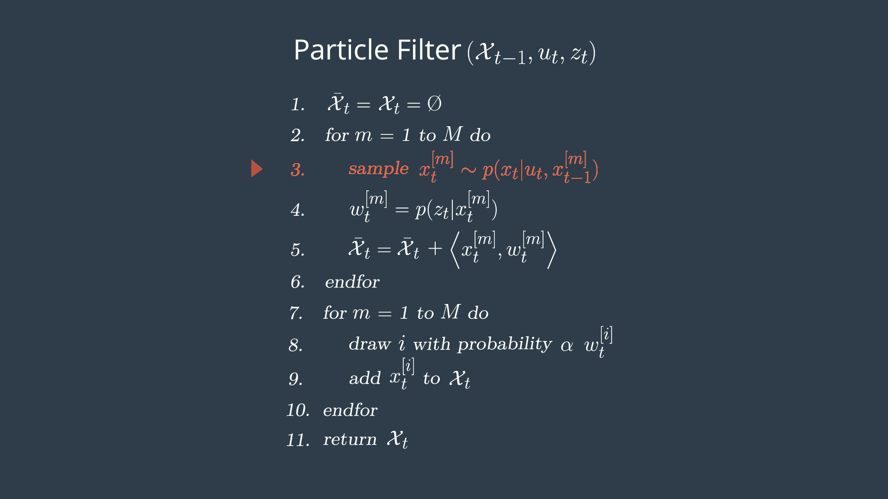

Project: Kidnapped Vehicle([`Particle Filter`](https://en.wikipedia.org/wiki/Particle_filter))
---

### Introduction

*The robot has been kidnapped and transported to a new location! Luckily it has a map of this location, a (noisy) GPS estimate of its initial location, and lots of (noisy) sensor and control data.*

*In this project we will implement a 2 dimensional particle filter in C++. The particle filter will be given a map and some initial localization information (analogous to what a GPS would provide). At each time step particle filter will also get observation and control data.*

---
||
|----------------------------------|
|[Running instructions](https://www.youtube.com/watch?v=neGq381AG64) |

### Particle Filter Implemetation
Following are the steps for a particle filter implentation.

**Note: These steps were taken from [Udacity Self Driving Car Engineer Nano Degree Programe](https://www.udacity.com/course/self-driving-car-engineer-nanodegree--nd013).**

##### Particle Filter Algorithm Steps and Inputs
*The flowchart below represents the steps of the particle filter algorithm as well as its inputs.*

||
|----------------------------------|
|Source: [Udacity Self Driving Car Engineer](https://www.udacity.com/course/self-driving-car-engineer-nanodegree--nd013) |

##### Psuedo Code

*This is an outline of steps you will need to take with your code in order to implement a particle filter for localizing an autonomous vehicle. The pseudo code steps correspond to the steps in the algorithm flow chart, initialization, prediction, particle weight updates, and resampling([Full C++ implementation](src/particle_filter.cpp)).* 

||
|----------------------------------|
|Source: [Udacity Self Driving Car Engineer](https://www.udacity.com/course/self-driving-car-engineer-nanodegree--nd013) |

##### Initialization

*At the initialization step we estimate our position from GPS input. The subsequent steps in the process will refine this estimate to localize our vehicle.*

||
|----------------------------------|
|Source: [Udacity Self Driving Car Engineer](https://www.udacity.com/course/self-driving-car-engineer-nanodegree--nd013) |

